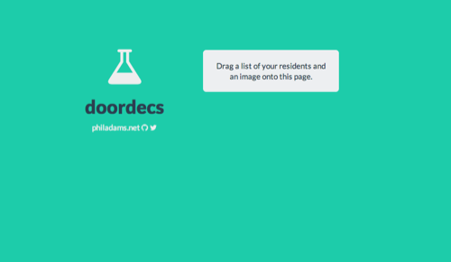
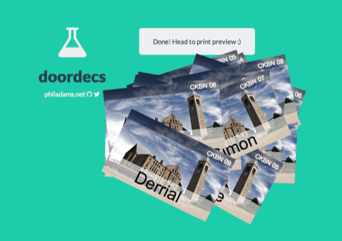
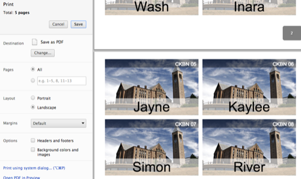

doordecs
========

Generate door decorations for university resident halls.

about
-----

The door-decs project is an excuse to mess around with `canvas` and the
HTML5 drag and drop library. It uses the following kick-ass tools:

- bootstrap and the flatly bootstrap theme
- font-awesome (icons)
- d3.js (for .csv parsing)

directions
----------

Load `index.html`. Drag-and-drop a .csv describing some residents, and a pretty
picture. Then print, setting the page orientation to landscape. Done.

A sample image and `residents.csv` file are under `/fixtures`; example outputs
are in `/example`.

future
------

- TODO image cropping if the aspect ratio is way off?
